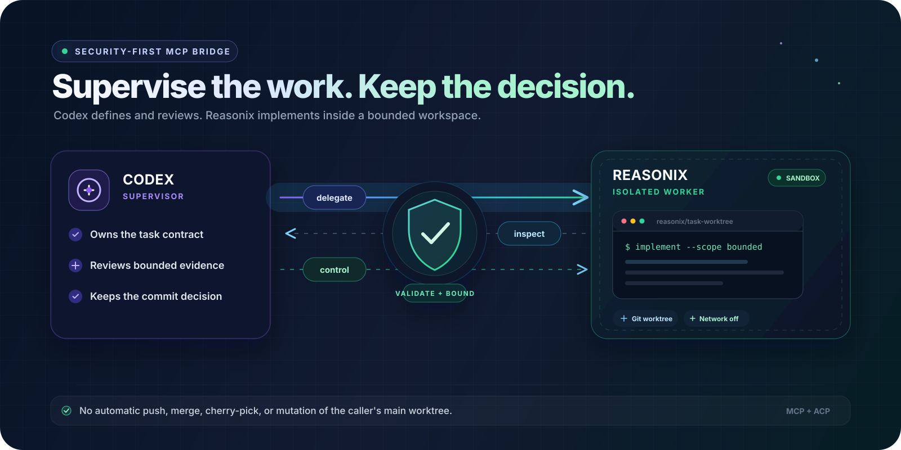

# codex-reasonix-mcp

[](https://github.com/rixzkiye/codex-reasonix-mcp/actions/workflows/ci.yml)
[](https://github.com/rixzkiye/codex-reasonix-mcp/actions/workflows/codeql.yml)
[](LICENSE)



`codex-reasonix-mcp` is a security-first MCP bridge that lets Codex supervise
Reasonix as an implementation worker. Codex owns the contract, review, and final
commit decision. Reasonix works in an isolated Git worktree through ACP Goal
mode. The bridge never pushes, merges, or changes the caller's main worktree.

This repository is generic to Git repositories. It contains no Akademi-specific
configuration, LLM router, or Codex source modification.

## Release status

The current package version is the stable `0.1.1` release. Official Reasonix
`v1.19.0` includes the ACP v1 supervisor and status capabilities required by
the bridge. Runtime capability checks remain authoritative, and incompatible
binaries fail closed before any model prompt is sent.

## Requirements

- Node.js 22 or newer
- pnpm 10 for source development
- Git 2.36 or newer (worktrees plus `git hook run`)
- Linux, macOS, or Windows through WSL; native Windows is rejected
- Reasonix v1.19.0 or a compatible newer build with the required ACP v1
  supervisor and status capabilities
- Bubblewrap on Linux/WSL or Seatbelt on macOS
- A configured Reasonix provider exposing `deepseek-v4-flash`

Reasonix, provider credentials, and provider billing remain user-managed. This
package neither downloads nor bundles Reasonix.

## Install for Codex

Pin the exact bridge version when registering the MCP server:

```sh
codex mcp add reasonix-worker -- npx -y codex-reasonix-mcp@0.1.1
```

For development against a locally built Reasonix checkout:

```sh
codex mcp add reasonix-worker \
  --env REASONIX_BIN=/absolute/path/to/reasonix \
  -- npx -y codex-reasonix-mcp@0.1.1
```

Run the non-model diagnostic before delegating work:

```sh
npx -y codex-reasonix-mcp@0.1.1 doctor
```

`doctor` checks Node, Git, platform/WSL, the Reasonix binary and supervisor
flags, ACP extension compatibility, OS sandbox availability, state permissions,
network posture, the required model selector, and the effective session
sandbox. It creates and closes an ACP diagnostic session but never sends a model
prompt.

## MCP surface

The server is named `reasonix_worker` and exposes exactly three tools:

- `reasonix_delegate` validates an immutable `TaskContractV1`, creates the
  worker branch/worktree/session, and returns while provisioning continues.
- `reasonix_control` steers, answers an interaction, cancels, finalizes, or
  closes a task. At most two post-review repair rounds are accepted.
- `reasonix_inspect` returns bounded status, evidence, interactions, events,
  and optional paginated diffs.

Codex calls `reasonix_delegate` only after the user explicitly requests or
approves Reasonix implementation. Once approved, Codex does not substitute
native subagents for that contracted work. Native Codex subagents remain the
right fit for bounded parallel exploration, tests, triage, or summaries that
do not require the Reasonix task lifecycle.

`reasonix_delegate` and finalization require Codex's
`codex/sandbox-state-meta`. A writable repository path is derived only from that
metadata; no model-provided repository path is accepted.

## Safe lifecycle

1. Codex creates a contract with explicit write and forbidden scopes.
2. The bridge rejects a dirty source worktree, creates `reasonix/<task-id>`, and
   places the worker worktree below its private state directory.
3. Reasonix runs Delivery + Goal with planner disabled, scoped writes, sandboxed
   bash, and network off by default.
4. Codex inspects bounded evidence and may request at most two repair rounds.
5. `finalize` reruns all verification, rechecks scope/size/secrets, stages explicit
   files, runs commit hooks against a disposable index, and advances the worker
   ref only when the resulting tree is byte-for-byte the reviewed tree.
6. The branch, worktree, contract, and evidence are retained. Nothing is pushed,
   merged, cherry-picked, or deleted automatically.

See [architecture](docs/architecture.md), [task contracts](docs/task-contract.md),
[configuration](docs/configuration.md), [security](docs/security.md), and
[troubleshooting](docs/troubleshooting.md).

## Develop

```sh
corepack enable
pnpm install --frozen-lockfile
pnpm check
pnpm audit --audit-level high
```

CI runs the same gates on Node 22/24 Linux and Node 22 macOS. npm releases use
GitHub OIDC trusted publishing with provenance and no long-lived npm token;
prerelease versions publish under the `next` dist-tag. See
[CONTRIBUTING.md](CONTRIBUTING.md) for the release gates.

The offline end-to-end test uses a fake ACP Reasonix agent and performs no live
provider calls or external mutations. A live DeepSeek smoke test is intentionally
not automated and requires explicit credential and cost authorization.

## Community

- Read [CONTRIBUTING.md](CONTRIBUTING.md) before proposing a change.
- Use the structured [bug report](https://github.com/rixzkiye/codex-reasonix-mcp/issues/new?template=bug_report.yml)
  or [feature request](https://github.com/rixzkiye/codex-reasonix-mcp/issues/new?template=feature_request.yml)
  forms for public work.
- Follow the [Code of Conduct](CODE_OF_CONDUCT.md) in all project spaces.
- Report vulnerabilities privately through
  [GitHub Security Advisories](https://github.com/rixzkiye/codex-reasonix-mcp/security/advisories/new),
  as described in [SECURITY.md](SECURITY.md).

## License

MIT. See [LICENSE](LICENSE).
